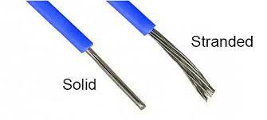
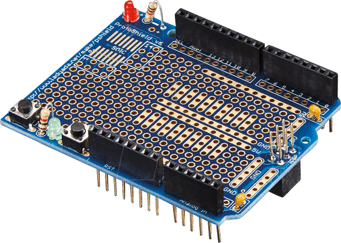
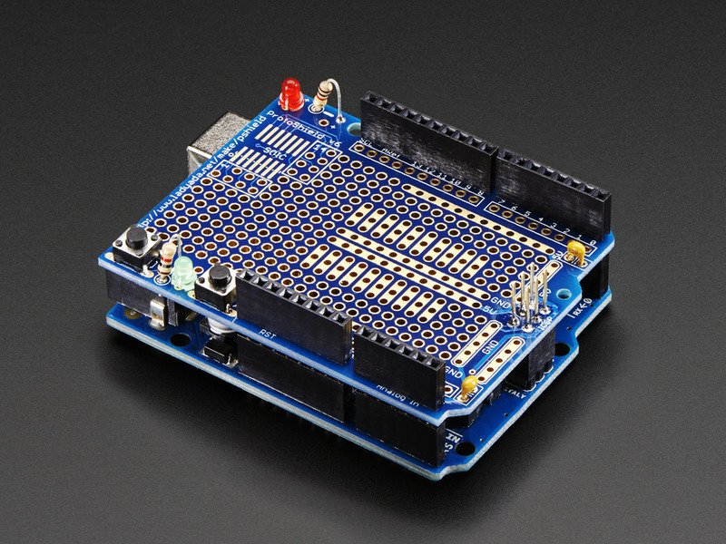
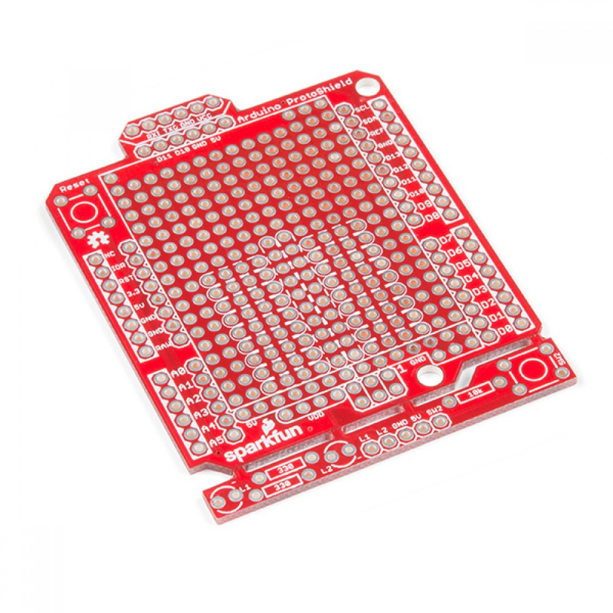
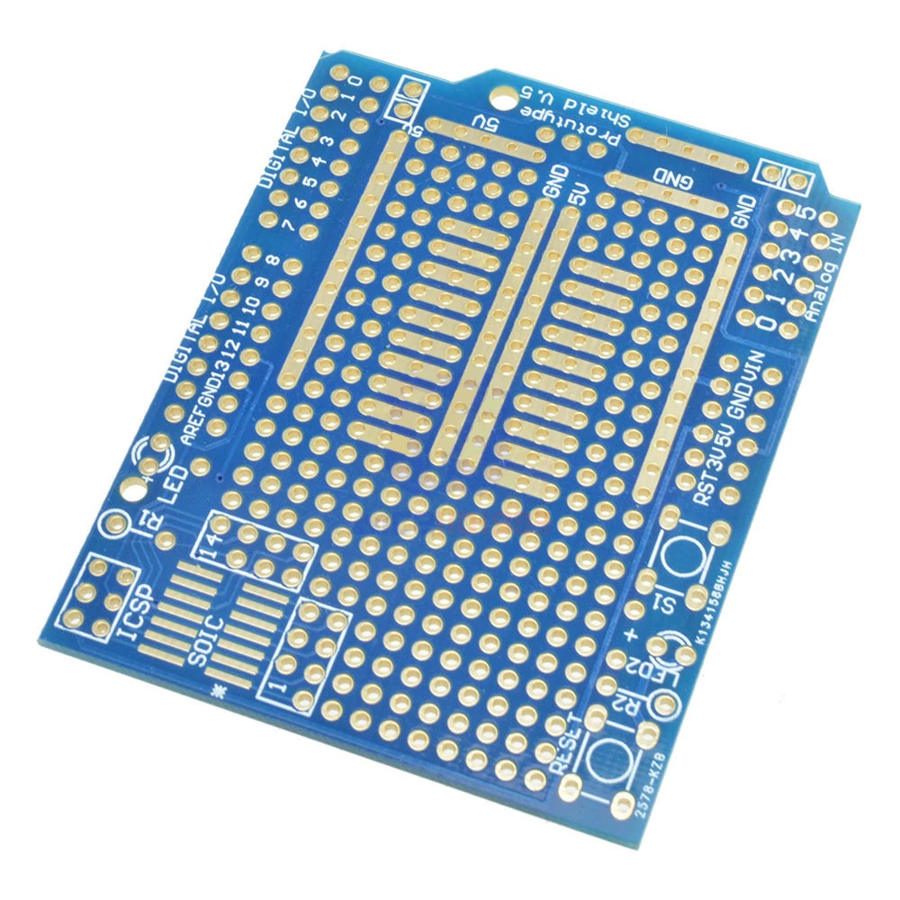
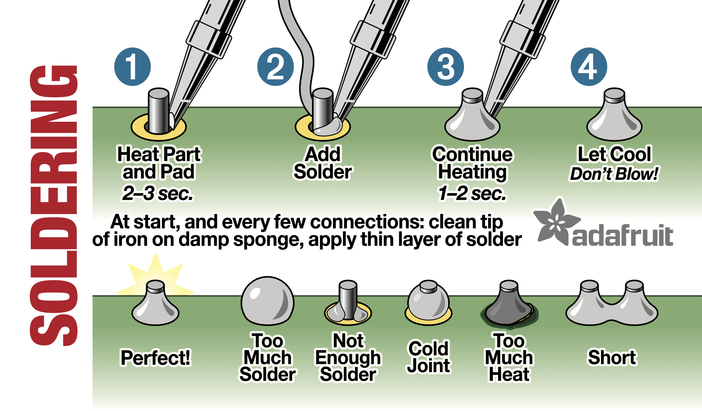

## How to create an acrylic enclosure:

Short summary of why an enclosure is necessary, i.e the benefits

Things you should know/Things to keep in mind:

- List of items you will need
- List of things you’ll need to prepare in advance
- List of experiences that might be required, relevant or helpful to complete the task

Steps (including pictures):

Build your project
- Prototyping on a solderless breadboard 
- Running tests
- 

## Solder your Project:

1. Before starting to solder your project begin by estimating and measuring how large you’d like your enclosure to be and in what position
    - Start by identifying where your arduino will be placed at the base of your enclosure. Note: It is best to screw your arudino into the enclosure to establish a        secure foundation for the circuit and ensure it does not move around loosely within the enclosure.
    - Once you know where your arudiono will be located, hold up the project how you’d like it to stand inside the enclosure. If you have extended parts, such as a         keypad and LEDs in this example, make note of how much wire you will need to reach from the arduino to the LED in the position you want. 
    - Take measurements of the height, width, and depth for your enclosure. Note: It is better to overestimate the measurements and have more space than to squeeze         everything into a smaller enclosure. 
2. It is recommended to not touch your working prototype but use it as a reference. To begin soldering, make sure to collect all the parts you need and ensure they are working properly. You can do this by replacing new parts in increments in the working prototype and making sure it is still functioning properly. 
    - Items you will need: anything you used in your prototype except for jumper wires, we will instead use stranded or solid wire.
        - Solid wire is thicker, and offers higher current capacity. They are greater for longer distances since it features less dissipation. 
        - Stranded wire offers superior bendability and flexibility, making them easier to route around obstacles. They can sustain more vibration and flexing without          breaking. 
        - When it comes down to choosing between solid and stranded wire there is no clear choice, pay attention to the needs of your project. 
        - 
    - You will also need an arduino prototyping shield. This is where you will solder your cricuit and eventually connect your arduino into. 
3. You will now solder your components into the arduino proto shield following the prototype you made earlier.
    - If you have never soldered before [here](https://www.youtube.com/watch?v=Qps9woUGkvI ) is a quick tutorial on how to solder electronic components
    - 
    - You will also need to solder female and/or male headers to the pin positions on both sides of the arudino proto shield. This is what will hold the shield in          place with the arduino and secure it. 
    - 
    - 

    
    
## Test/Troubleshooting the Soldered Project:

1. Once you have completed the soldering of your project, you can now plug it into your ardunio and test to see if it works
    - Note: If your project isn’t working, do not be alarmed it is very typical to run into problems at this stage. 
2. If you run into problems begin by testing the arudino against the original prototype to ensure the code is still running properly.
3. You can then reference your prototype and ensure you have connected all the necessary wires, resistors, etc. properly.
    - Pay close attention to your arduino proto shield and ensure horizontal connections are properly connected. Note: Shields come in different versions, some pre-        connect rows and others do not.
    -  
4. If your circuit is properly connected then take a closer look at the soldering of your components.	
    - You may need to use a magnifying glass to take a closer look at the connection. Make sure that the solder is not only on the component but securly attached to        the shield as well. Note: Lightly tugging on the wires may help identify a loose connection.
    - 
5. Reestablish any loose connections with solder.
    - If you made a mistake while soldering, you make correct it by reheating the misplaced solder. This will turn it back into liquid, and you must quickly slap it        onto a table or surface to remove it. 
6. Revisit steps 2-6 until your are able to troubleshoot and get your project working. Once it is up and running we can begin creating the enclosure. 

## Desinging the Enclosure: 

1. Figure what kind of enclosure you want. Enclosures can be made out of many different materials depending on the purpose and usage of the project. However, for this section we will focus on acrylic for the enclosure. 
    - Benefits for acrylic:
        - Excellent optical clarity & transparency
        - Highly resistant to variations in temperature
        - Up to 17 times the impact resistance of ordinary glass
        - Half the weight of glass and idea for precision machining
        - Highly resistant to different chemicals
    - Disadvantages for acrylic:
        - Acrylic is touch and durable, but can also be easily scratched
2. Choose an enclosure design. Using a design platform like, https://en.makercase.com/, you can choose from 3 different enclosure designs: Basic box, polygon box, kerf bent box. 
3. Modify enclosure design. Using the same platform you can now modify the box your creating. 
    - Modifications include width, height, and depth of the box. Using the prior measurements you took input the amounts to see a virtual display of your enclosure.You     can also indicate whether the measurements are for the inner or outer dimensions.
    - The thickness of your box should correspond to the acrylic piece you will be using.
    - You can also decide whether you’d like the box to be open or closed
    - Finally, choose the type of edge you’d like for the box. Using a flat or finger edge will require the use of acrylic glue to stablize the enclosure. Note: if you     need to access the inside of the box, this would be made difficult with these choices. Alternatively, t-slot edges are held with bolts. You can decide the type of      bolt diameter and length depending on what you have available. This allows you to access the inside of the box if any debugging or adjustments are necessary while      still maintaining the secure exterior. 
4. Customization:Upload to Abobe illustrator. If you’d like to futher customize the enclosure you can download the previously created design and upload it to adobe illustrator. 
    - Using the selection tool you can drag edges as preferred for any customized sides or pieces.
5. Print a prototype. Once you’ve completed any customization and finalized the design you can now print a protoype on cardboard to ensure the size works for your project before printing on acrylic.
6. Adjust if needed and print final enclosure. Make as many adjustments as needed repeating steps 3-5 and using cardboard prototypes. Once you have a design that fits your project, print on acrylic and put your final enclosure together. 

Print with a laser cutting machine
- Upload the file to adobe illustrator 
- Follow laser cutting instructions
- Print a prototype on cardboard
- Test the enclosure with your soldered project
- If adjustments are necessary revisit step 4, if not proceed to print on acrylic

Put the enclosure together
- Once the pieces are printed, put the box together 
- Test again for any errors 

